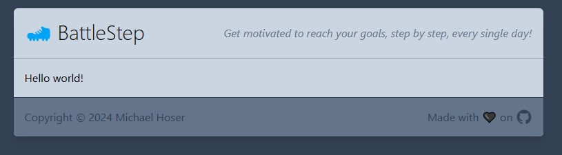

# BattleStep

**Get motivated to reach your goals, step by step, every single day!**

You should have some goals. To do more or less of something. And to do this every single day - which sometimes can be a kind of battle. A typical battle of this kind, especially during a pandemic or when doing home-office, can be to reach your daily movement goal - or to be more concrete: walk 10.000 steps a day or 70.000 steps during the week.

[**Don't break the chain!**](https://lifehacker.com/jerry-seinfelds-productivity-secret-281626)
Every single day counts!

Goals could also go in the opposite direction:

* Don't drink too much coffee.
* Don't eat (too much) meat until Easter Sunday

Others may be:

* Drink some water. Regularly. At least half the ocean...
* Keep up with learning Astro by updating this repo. Daily.

And finally you are most likely **more committed** to your goals if those are shared with your friends. An extra motivation!

To provide all this without any larger concerns regarding **data privacy**, user tracking and such, BattleStep does the following: Request as little data as possible (no email-address required, no real name), take your data and go (CSV export and permanent account wipe), revocable and transparent sharing of selected data with friends, option to self host everything, no ads.

## Current State

This project was **restarted** during Easter holidays 2024, and then again during the Session #55 around Easter 2025.

Nice vision but very litte functionality until now.
*Let's see...*

## Development Setup

* Install Tooling

  | Tool                                                | Download                                               |
  |-----------------------------------------------------|--------------------------------------------------------|
  | [Git](https://git-scm.com/downloads)                | `winget install --id Git.Git -e --source winget`       |
  | [Node.Js](https://nodejs.org/en/download)           | `winget install --id OpenJS.NodeJS -e --source winget` |
  | [Visual Studio Code](https://code.visualstudio.com) | [Download](https://code.visualstudio.com/download)     |

* Clone the repo: `git clone https://github.com/ramdacxp/BattleStep.git`
* Install packages: `npm install`
* Start the frontend: `npm start`

A detailed list on how this project was setup [can be found here](Setup.md).

## Feature list & progress

* [x] Cleanup old Angular version & fresh restart (3/2024)
* [x] Astro and Tailwind based site
* [x] Prototype to use browser's local storage
* [x] Second project restart ;) at [Session 55](https://session.pestilenz.org/)
* [ ] Deploy to public hosting (DE-domain?)
* [ ] API Backend
* [ ] User Profile
* [ ] Enter and store daily steps
* [ ] List of daily steps per week
* [ ] Configure daily/weekly step goal
* [ ] Show streak length
